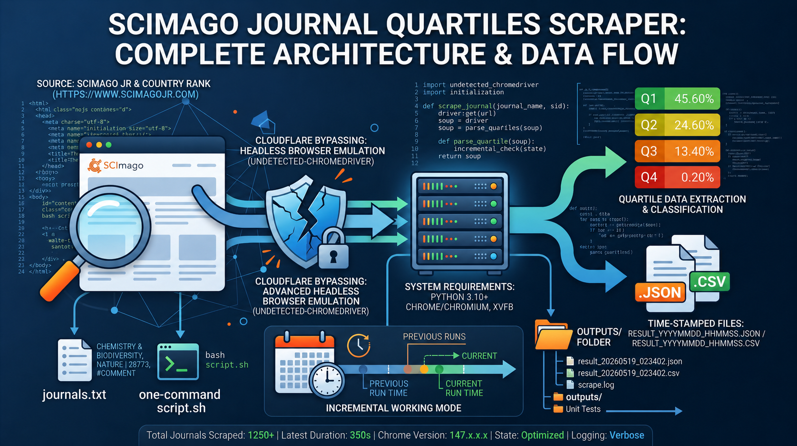

# SCImago Journal Quartiles Scraper

SCImago Journal & Country Rank sitesinden dergi listesi için **Quartiles** verisini otomatik olarak çeker. Cloudflare korumasını aşar, taşınabilir ve tekrar çalıştırılabilirdir.

## Özellikler

- **Cloudflare korumasını aşar** (`undetected-chromedriver`)
- **Tek komut** ile JSON + CSV çıktı üretir
- **Zaman damgalı** dosyalar (`result_YYYYMMDD_HHMMSS.json/csv`)
- **Artımlı çalışma**: Önceki başarılı sonuçları atlar, sadece yeni/eklenen dergileri çeker
- **Taşınabilir**: Proje içinde kendi Python sanal ortamını barındırır
- **Chrome versiyonu otomatik tespit**: Sistemdeki Chrome/Chromium sürümünü algılar
- **Zengin loglama**: `outputs/scrape.log` içinde tarih, süre, hata listesi ve mod bilgisi tutar
- **Birim testleri**: `test.sh` ile dosya varlığı, syntax ve fonksiyonel testler çalıştırılır

## Dosya Yapısı

```
dergi_prod/
├── journals.txt           # Girdi: dergi listesi
├── scrape_uc.py           # Ana scraper (Python)
├── convert_to_csv.py      # JSON → CSV dönüştürücü (Python)
├── script.sh              # Tek komutla çalıştırma
├── setup.sh               # İlk kurulum (venv + bağımlılıklar)
├── test.sh                # Birim testleri
├── requirements.txt       # Python paket listesi (pinli)
├── README.md              # Bu doküman
├── ortalama.md            # Zamanlama referansı ve eşik değerler
├── flowChart.png          # Proje akış şeması
├── venv/                  # Python sanal ortamı (setup.sh ile oluşur)
└── outputs/               # Çıktılar
    ├── result_*.json      # Ham veri
    ├── result_*.csv       # Düzleştirilmiş CSV
    └── scrape.log         # Çalıştırma özetleri (her çalıştırmada append)
```

## Proje Akış Şeması



## Gereksinimler

- Python 3.10+
- Google Chrome veya Chromium
- `xvfb` (sunucu ortamında ekran emülasyonu için)

### Ubuntu/Debian Kurulumu

```bash
sudo apt-get update
sudo apt-get install -y python3-venv xvfb google-chrome-stable
```

## Kurulum

```bash
cd dergi_prod
bash setup.sh
```

Bu komut:
1. Python 3, Chrome, xvfb gibi sistem bağımlılıklarını kontrol eder
2. Proje içinde `venv/` sanal ortam oluşturur
3. `requirements.txt`'den Python paketlerini kurar

## Kullanım

### Tek komutla çalıştırma

```bash
bash script.sh
```

- **İlk çalıştırma**: Tüm dergileri baştan çeker (`mode=full`)
- **Sonraki çalıştırmalar**: Önceki başarılı sonuçları atlar, sadece yeni/eklenen dergileri çeker (`mode=incremental`)
- Çıktılar `outputs/` altına zaman damgalı olarak düşer

### Testleri çalıştırma

```bash
bash test.sh
```

13 birim testi çalıştırır: dosya varlığı, Python syntax, CSV dönüşümü, parse fonksiyonu.

### Manuel çalıştırma

```bash
source venv/bin/activate

# JSON üret
xvfb-run --auto-servernum python3 scrape_uc.py journals.txt outputs/sonuc.json

# Önceki state ile artımlı çekim
xvfb-run --auto-servernum python3 scrape_uc.py journals.txt outputs/sonuc.json --state outputs/result_*.json

# CSV'ye dönüştür
python3 convert_to_csv.py outputs/sonuc.json outputs/sonuc.csv
```

## Girdi Formatı (`journals.txt`)

Her satır bir dergi:

```txt
CHEMISTRY & BIODIVERSITY
IEEE ACCESS
Nature | 28773
# Bu satır yorumdur
```

- `|` ayırıcı ile **SID** verilebilir (daha stabil ve hızlı)
- `#` ile başlayan satırlar yorumdur
- Yeni dergi ekledikçe dosyanın sonuna satır ekleyip `bash script.sh` çalıştırmanız yeterli

## Çıktı Formatları

### JSON (`result_YYYYMMDD_HHMMSS.json`)

Her dergi için:
```json
{
  "query": "CHEMISTRY & BIODIVERSITY",
  "sid": "130069",
  "ok": true,
  "journal_url": "https://www.scimagojr.com/journalsearch.php?q=130069&tip=sid&clean=0",
  "rows": [
    {"category": "Biochemistry", "year": "2005", "quartile": "Q3"}
  ],
  "error": null,
  "timestamp": "2026-05-19T02:34:02.683909"
}
```

- `ok: false` olan kayıtlarda `journal_url: null`, `sid: null` ve `error` alanı doludur
- Yanlış veri eşleştirme riski ortadan kaldırılmıştır

### CSV (`result_YYYYMMDD_HHMMSS.csv`)

```csv
query,sid,category,year,quartile,timestamp
"Chemistry and Biodiversity","130069","Biochemistry","2005","Q3","2026-05-19T02:34:02.683909"
```

### Log (`outputs/scrape.log`)

Her çalıştırmada append edilir:

```
[2026-05-19 02:45:51] 31 total | 26 OK | 5 ERR | 1338 rows | duration=50s | mode=incremental | chrome=147 | errors=[APPLIED SCIENCES-BASEL, JOURNAL OF MENS HEALTH, ...] | file=result_20260519_024501.json
```

Alanlar:
- `total`: Toplam dergi sayısı
- `OK/ERR`: Başarılı / başarısız dergi sayısı
- `rows`: Toplam quartile satır sayısı
- `duration`: Çalışma süresi
- `mode`: `full` veya `incremental`
- `chrome`: Chrome ana versiyonu
- `errors`: Başarısız dergi isimleri (100 karakter limitli)
- `file`: Üretilen JSON dosyasının adı

## Sorun Giderme

| Hata | Çözüm |
|------|-------|
| `Chrome not found` | Chrome/Chromium kurun |
| `xvfb-run not found` | `apt-get install xvfb` |
| `venv not found` | Önce `bash setup.sh` çalıştırın |
| `undetected_chromedriver` hatası | `bash setup.sh` ile yeniden kurun |
| Tek dergi > 60 sn | Cloudflare/IP sorunu; `--delay` artırın veya bir süre bekleyin |
| 30 dergi > 25 dk | IP bloklanmış olabilir; farklı IP/proxy deneyin |

Detaylı zamanlama referansı için `ortalama.md` dosyasına bakın.

## Logging

`scrape_uc.py` standart `logging` modülünü kullanır. Detaylı log için:

```bash
python3 scrape_uc.py journals.txt outputs/sonuc.json --verbose
```

## Notlar

- **Veri kalitesi**: Başarısız dergilerde `journal_url` ve `sid` alanları `null` olarak döner. Yanlış eşleşme riski yoktur.
- **Taşınabilirlik**: Sadece `dergi_prod/` klasörünü kopyalayıp hedef makinede `bash setup.sh && bash script.sh` yapmak yeterli.
- **requirements.txt**: Tüm paketler sabit sürümle (`==`) pinlenmiştir; tekrarlanabilir kurulum garantilidir.

## Lisans

ISC
